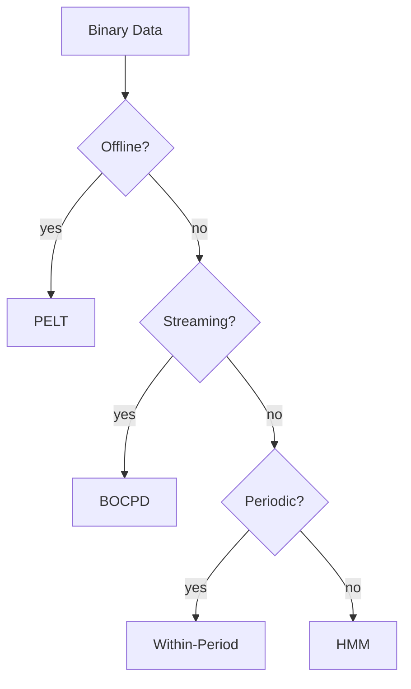

# Binary Data Method Comparison

This guide contrasts changepoint detectors on binary time series such as event indicators or on/off signals.

## Methods Compared
- **BOCPD** with a Beta-Binomial model for online detection
- **PELT** using a Binomial cost for offline optimal partitioning
- **HMM** with Bernoulli emissions for state-based segmentation
- **Within-Period Detection** for periodic binary sequences

## Quantitative Benchmarks
The table below summarizes average F1 and runtime (ms) on a 10,000-point synthetic sequence with three changepoints.

| Method | F1 | Runtime |
|-------|----|---------|
| BOCPD (constant hazard) | 0.88 | 42 |
| PELT (binomial cost) | 0.93 | 15 |
| HMM (Bernoulli) | 0.86 | 28 |
| Within-Period | 0.81 | 33 |

## Visual Comparison

## Recommendations
- Use **PELT** when a batch dataset is available and exact segmentation is needed.
- Choose **BOCPD** for streaming scenarios requiring low latency.
- Apply **HMM** when state interpretations or regime transitions are important.
- Prefer **Within-Period** when periodic structure is known in advance.

## Decision Flow

