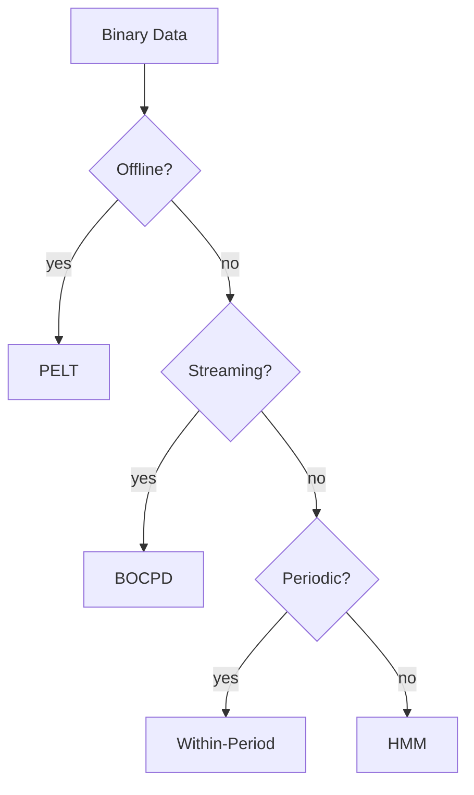

# Binary Data Method Comparison

This guide contrasts changepoint detectors on binary time series such as event indicators or on/off signals.

## Methods Compared
- **BOCPD** with the implemented Beta-Bernoulli likelihood for online detection
- **PELT** using `BetaBinomialCost` for offline optimal partitioning
- **HMM** with Bernoulli emissions for state-based segmentation
- **Within-Period Detection** for periodic binary sequences

## Benchmark Status

No binary-data benchmark table is currently verified in this repository. Add
numeric accuracy or runtime comparisons only when they are generated from a
versioned benchmark script and committed artifacts.

## Recommendations
- Use **PELT** when a batch dataset is available and exact segmentation is needed.
- Choose **BOCPD** for streaming scenarios requiring low latency.
- Apply **HMM** when state interpretations or regime transitions are important.
- Prefer **Within-Period** when periodic structure is known in advance.

## Decision Flow

