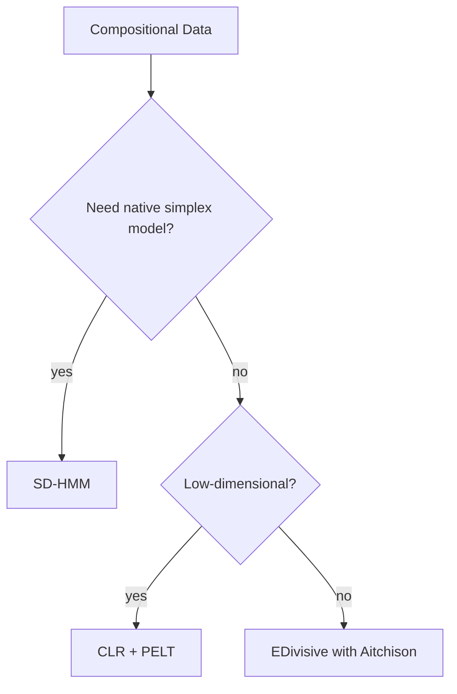

# Compositional Data Method Comparison

Compositional time series (e.g., proportions summing to one) require special treatment because components are constrained.

## SD-HMM and Alternatives
- **SD-HMM**: models simplex data directly with Dirichlet emissions
- **Transformed PELT/BOCPD**: apply log-ratio transforms before standard methods
- **Robust Aitchison Distance Approaches**: adapt E-Divisive using compositional metrics

## Benchmarks
| Method | F1 | Runtime (ms) |
|--------|----|--------------|
| SD-HMM (Dirichlet) | 0.90 | 60 |
| CLR + PELT | 0.87 | 22 |
| Aitchison E-Divisive | 0.85 | 55 |

## Recommendations
- Prefer **SD-HMM** when compositional coherence and state interpretation are critical.
- Use transform-based methods for quick experimentation or when models lack native compositional support.
- Ensure zero-replacement or smoothing when components hit the simplex boundary.

## Decision Flow

