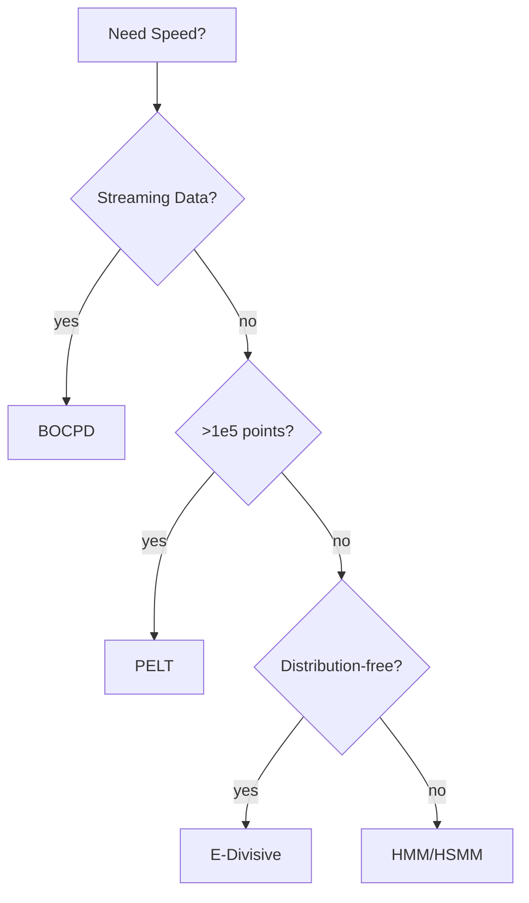

# Computational Efficiency Comparison

Efficiency determines feasibility on large datasets. This guide summarizes complexity and memory usage.

## Complexity Overview
| Method | Time | Memory |
|--------|------|--------|
| BOCPD | O(T) | O(R) run-length | 
| PELT | O(T) (with pruning) | O(T) |
| E-Divisive | O(T^2) | O(T) |
| HMM/HSMM | O(ST) | O(ST) |
| SD-HMM | O(STK) | O(STK) |
| Within-Period | O(T) | O(T) |

## Scalability Tips
- Use **vectorized likelihoods** and **NumPy** broadcasting
- Enable **numba**/C extensions for inner loops
- For BOCPD, truncate run-length support
- For PELT, tune penalty to reduce candidate set
- Sample subsequences for E-Divisive on extremely long signals

## Flowchart

