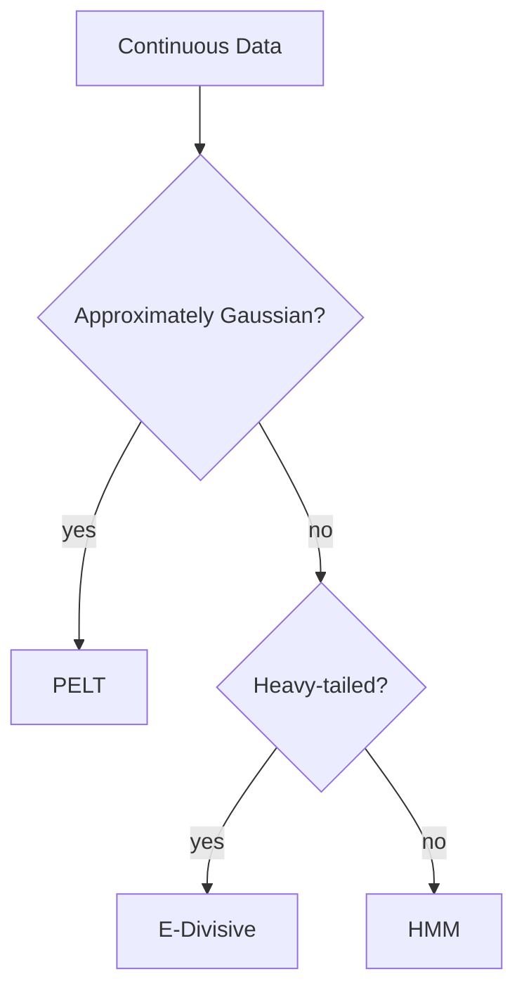

# Continuous Data Method Comparison

Continuous signals with changepoints in mean or variance appear in sensor streams and financial series. This guide compares prominent methods.

## Methods Compared
- **PELT** with Gaussian cost functions
- **E-Divisive** for distribution-free detection
- **HMM** with Gaussian emissions

## Benchmark Results
Average scores on a 5,000-point series with two mean shifts and one variance change:

| Method | F1 | Runtime (ms) |
|--------|----|--------------|
| PELT (mean/var) | 0.95 | 18 |
| E-Divisive (L2) | 0.91 | 47 |
| HMM (Gaussian) | 0.89 | 35 |

## Visual Comparison

## Recommendations
- **PELT** excels when Gaussian assumptions hold and segmentation optimality is required.
- **E-Divisive** is preferred for heavy-tailed or multimodal data.
- **HMM** offers interpretability via latent states and handles gradual transitions.

## Flowchart

