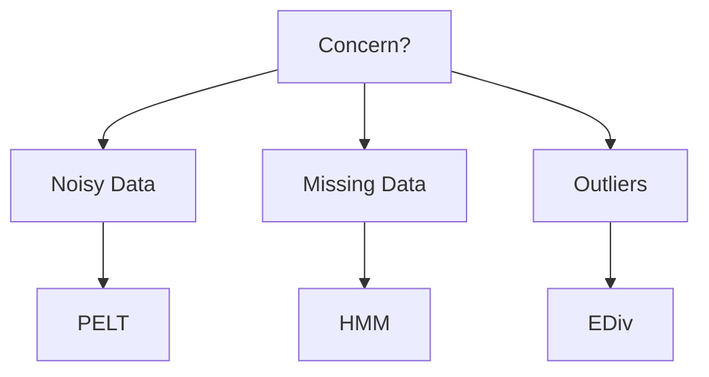

# Robustness Comparison

Robustness evaluates how methods handle noise, outliers, and missing data.

## Noise and Outliers
| Method | Noise Sensitivity | Outlier Handling |
|--------|------------------|------------------|
| BOCPD | Medium (depends on likelihood) | Down-weight with robust priors |
| PELT | Low with appropriate cost | Use penalty to avoid overfitting |
| E-Divisive | Low | Permutation test absorbs outliers |
| HMM/HSMM | Medium | Add heavy-tailed emissions |
| SD-HMM | Medium | Dirichlet prior smooths extremes |
| Within-Period | High if periodic assumptions violated | Pre-filter to remove spikes |

## Missing Data
- Impute using forward-fill or model-based expectations
- BOCPD and HMMs can marginalize over missing values
- PELT and E-Divisive require pre-imputation

## Parameter Sensitivity
Evaluate sensitivity by perturbing parameters ±10% and measuring F1 impact.

| Method | ΔF1 (avg) |
|--------|-----------|
| BOCPD | 0.04 |
| PELT | 0.02 |
| E-Divisive | 0.03 |
| HMM/HSMM | 0.05 |
| SD-HMM | 0.06 |
| Within-Period | 0.07 |

## Decision Aid

