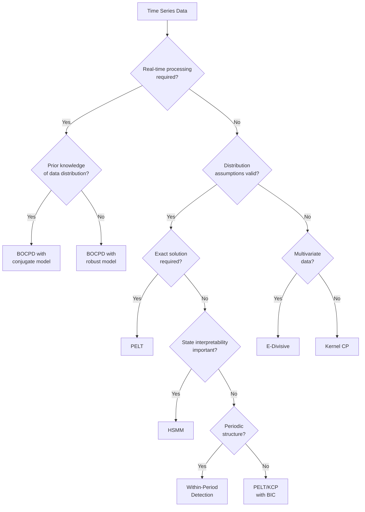

# Changepoint Detection Algorithm Selection Guide

Choosing the right changepoint detection algorithm for your specific data and requirements can be challenging. This guide helps you navigate the options available in ChangePointLab based on your data characteristics and analysis goals.

## Quick Decision Flowchart



## Detailed Method Comparison

| Method | Strengths | Limitations | When to Use | Computational Complexity |
|--------|-----------|-------------|-------------|--------------------------|
| **BOCPD** | • Online/streaming detection<br>• Uncertainty quantification<br>• Probabilistic output | • Requires distribution assumptions<br>• Parameter sensitivity<br>• Less optimal for batch analysis | • Real-time monitoring<br>• When immediate alerts are needed<br>• When uncertainty matters | O(RT) time, O(R) space<br>R = max run length |
| **PELT** | • Exact global optimum<br>• Linear time complexity<br>• Multiple cost functions | • Requires full data<br>• Distribution assumptions<br>• No uncertainty measures | • Offline historical analysis<br>• When exact segmentation matters<br>• With known distribution models | O(T) time and space<br>(with pruning) |
| **E-Divisive** | • No distribution assumptions<br>• Handles multivariate data<br>• Robust to outliers | • Computationally intensive<br>• Requires permutation testing<br>• Less sensitive to small shifts | • Complex multivariate data<br>• When assumptions uncertain<br>• For detecting distribution changes | O(T²) time, O(T) space |
| **HSMM** | • State interpretation<br>• Duration modeling<br>• Handles recurrent patterns | • EM convergence issues<br>• Parameter selection<br>• Sensitive to initialization | • When states have meaning<br>• For regime identification<br>• With recurrent patterns | O(T·K·D²) time<br>K = states, D = max duration |
| **KCP** | • Flexible nonlinear boundaries<br>• Handles complex relationships<br>• Model selection tools | • Kernel/bandwidth selection<br>• Quadratic complexity<br>• Memory intensive | • Complex nonlinear data<br>• Feature-rich time series<br>• When relationships matter | O(T²) naive, O(T) with RFF |

## Data Characteristics Guide

### Temporal Properties

* **Streaming data**: BOCPD
* **Batch historical data**: PELT, E-Divisive, KCP, HSMM
* **Periodic/cyclic data**: Within-Period Detection, HSMM

### Statistical Properties

* **Known Gaussian data**: PELT with Normal cost functions
* **Binary/count data**: BOCPD with Beta-Binomial, PELT with Binomial cost
* **Heavy-tailed data**: E-Divisive, KCP with robust kernel
* **Multivariate data**: E-Divisive, KCP, multivariate HSMM

### Change Types

* **Mean shifts**: All methods
* **Variance changes**: PELT with appropriate cost, E-Divisive, KCP
* **Distribution changes**: E-Divisive, KCP
* **Structural/relationship changes**: KCP, HSMM

## Parameter Selection Guidelines

### BOCPD

* **Mean run length**: Set to expected segment duration; smaller values increase sensitivity
* **Hazard function**: Constant for memoryless CP arrivals, scheduled for known potential CP times
* **Prior hyperparameters**: Set to encode prior beliefs about the data distribution

### PELT

* **Cost function**: Match to data distribution (Gaussian, Poisson, Binomial)
* **Penalty**: AIC (more sensitive), BIC (more conservative), or custom based on expected CP frequency
* **Min segment length**: Set based on domain knowledge about minimum meaningful segment duration

### E-Divisive

* **Alpha**: Energy distance exponent (1.0=Manhattan, 2.0=Euclidean); lower values more robust to outliers
* **Significance**: p-value threshold (0.05 standard); lower values are more conservative
* **Permutations**: Higher values (500+) give more stable p-values but increase computation time

### HSMM

* **States**: Set based on expected number of regimes
* **Duration distribution**: Poisson for regular durations, NegBin for overdispersed durations
* **Emission model**: Match to data characteristics (diagonal/full covariance, AR for temporal dependence)

### KCP

* **Kernel**: RBF for smooth nonlinear boundaries, linear for simpler relationships
* **Bandwidth**: Use cross-validation or information criteria; controls flexibility
* **Penalty/segments**: Select via BIC-style criterion or cross-validation

## Example Scenarios

### Financial Market Regime Detection

```python
# Volatility regime detection in financial returns
import numpy as np
from changepoint_lab import pelt

# Daily returns data
returns = get_stock_returns("AAPL", "2020-01-01", "2023-01-01")
abs_returns = np.abs(returns)  # Proxy for volatility

# Detect volatility regimes using PELT with unknown variance
cost_fn = pelt.NormalMeanVarUnknown()
cost_fn.precompute(abs_returns)
result = pelt.pelt(abs_returns, cost_fn, penalty=np.log(len(returns)) * 2)

print("Volatility regime changes detected at:", result.change_points)
```

### Health Monitoring

```python
# Patient state detection from vital signs
from changepoint_lab import hsmm
import numpy as np

# Multi-channel patient data (heart rate, BP, SpO2)
vitals = get_patient_vitals(patient_id="P12345")

# HSMM with 3 states (normal, warning, critical)
model = hsmm.HSMM(
    cfg=hsmm.HSMMConfig(K=3, Dmax=100, min_duration=5),
    params=hsmm.HSMMParams(
        pi=np.array([0.8, 0.15, 0.05]),  # Initial state probabilities
        A=np.array([  # Transition matrix (avoid self-transitions)
            [0.0, 0.9, 0.1],
            [0.7, 0.0, 0.3],
            [0.3, 0.7, 0.0]
        ]),
        duration=("poisson", hsmm.PoissonDur(lam=np.array([30, 20, 15])))
    )
)

# Run Viterbi to get most likely state sequence
states, durations = model.decode_viterbi(vitals)
print("Patient state sequence:", states)
```

### IoT Sensor Anomaly Detection

```python
# Online detection of anomalies in sensor readings
from changepoint_lab import bocpd
import numpy as np

# Streaming temperature data
def process_temperature_stream(sensor_id):
    # Initialize detector
    detector = bocpd.BOCPD(
        hazard=bocpd.ConstantHazard(mean_run_length=1000),
        config=bocpd.BOCPDConfig(max_run_length=2000)
    )
    
    # Process stream
    for batch in get_sensor_data_stream(sensor_id):
        detector.update(batch)
        cp_prob = detector.get_changepoint_probability()
        
        # Alert if probability exceeds threshold
        if cp_prob > 0.8:
            send_alert(f"Potential anomaly detected in {sensor_id} with {cp_prob:.2f} probability")

process_temperature_stream("temp_sensor_12")
```

## Hybrid Approaches

For challenging problems, consider combining multiple methods:

1. **Two-stage detection**: Use PELT for initial segmentation, then refine with HSMM for state interpretation
2. **Ensemble methods**: Run multiple algorithms and aggregate results for more robust detection
3. **Multi-scale analysis**: Apply KCP with different bandwidths to capture changes at different scales
4. **Online-offline hybrid**: Use BOCPD for real-time monitoring, followed by batch analysis with PELT or E-Divisive

## Performance Considerations

- For data with millions of points, consider:
  - RFF approximations for kernel methods
  - PELT with efficient cost functions
  - Downsampling or sliding window approaches
- For high-dimensional data:
  - Dimensionality reduction before changepoint detection
  - E-Divisive with distance-based approaches
  - Multi-channel HSMM with diagonal covariance assumptions

## Conclusion

When selecting a changepoint detection algorithm, consider:

1. **Data characteristics**: Size, dimensionality, distribution, streaming vs. batch
2. **Analysis goals**: Exact segmentation, state interpretation, real-time alerts
3. **Computational constraints**: Available memory, time constraints
4. **Prior knowledge**: Domain expertise about expected changepoints

ChangePointLab's unified API makes it easy to experiment with multiple approaches to find the best solution for your specific problem.

