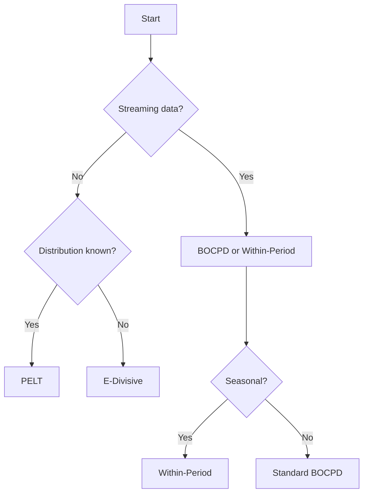

# Choosing a Changepoint Method

Selecting the right algorithm depends on data characteristics, latency requirements, and statistical assumptions.

## Comparison of Methods
| Method | Type | Strengths | Limitations |
|-------|------|-----------|-------------|
| BOCPD | Bayesian online | Fast updates, probabilistic output | Requires hazard selection |
| PELT | Optimization offline | Global optimum, flexible costs | Needs full data, penalty tuning |
| E-Divisive | Nonparametric offline | Few assumptions, multivariate | Permutation cost |
| HMM/HSMM | State-space | Learns latent states, durations | EM convergence, model choice |
| SD-HMM | State-space | Handles compositional data | More parameters |
| Within-Period | Bayesian online | Captures periodic regimes | Assumes known period |

## Combining Methods
- Use **PELT** for coarse segmentation then refine with **BOCPD** for online monitoring.
- Validate **BOCPD** results with **E-Divisive** to confirm detected shifts.
- Initialize **HMM** state sequences with **E-Divisive** segments.

## Performance Considerations
- Online methods trade accuracy for latency.
- Nonparametric techniques require permutation tests, increasing runtime.
- State-space models benefit from GPU or compiled implementations for long sequences.

Refer to [performance tests](../tests/unit/test_performance.py) for empirical benchmarks.
